# Mandate

### *Bounded Economic Authority for Autonomous AI Agents*

> **We gave an AI agent a real budget and control of our production infrastructure. Then we broke the infrastructure on purpose and let it pay its way out — on-chain, unsupervised.**

Existing agent wallets answer **how** an AI can pay. Mandate answers **when it is
allowed to pay, who it may pay, what it must receive in return, and what happens
when something goes wrong.**

### The whole system, in one picture

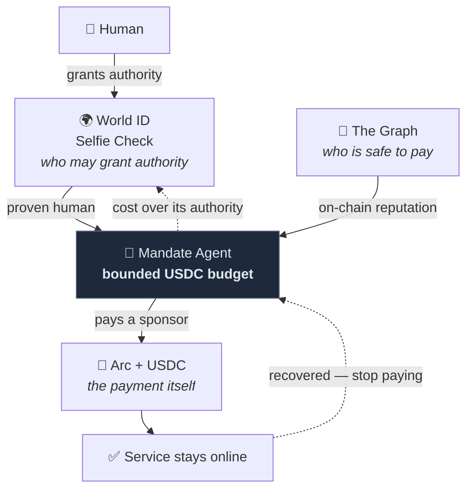

**Each sponsor carries one job no other piece can do.** World ID decides *who is
allowed to grant authority*, The Graph decides *who is safe to pay*, and Arc is
*the payment itself*. Remove any one and the loop stops working — the detail is
in [Why the sponsors **are** the system](#why-the-sponsors-are-the-system).

---

## ⚡ FAST LINKS

| | |
| :--- | :--- |
| 🌐 **Live platform** | **https://mandate.expo.app** |
| 🚀 **Quick guide — break it yourself in 60 seconds** | [jump ↓](#quick-guide) |
| 🤖 **For AI agents / automated review** | [`AGENTS.md`](AGENTS.md) |
| 🧾 **Integration feedback & engineering log** — every problem we hit, per technology, with the code to check | [`FEEDBACK.md`](FEEDBACK.md) |
| 🔍 **Verify every claim without trusting the UI** | [jump ↓](#verify) |
| 🧭 **How it actually works** | [jump ↓](#how-it-works) |

### Judges — jump straight to your track

| Track | Why we are applicable | Evidence |
| :--- | :--- | :--- |
| **The Graph** — Best AI Tooling or AI Use Case *(Start Fresh)* | We deployed **our own subgraph** that hand-decodes ERC-4337 calldata `graph-node` cannot decode, and it is **load-bearing three times over**: it decides who the agent is allowed to pay, it can **halt a real payment** before it is signed, and it is the **paid fallback that serves live traffic** during an outage. Not a dashboard reading a subgraph — a subgraph that moves money. | [→ The Graph section](#the-graph) |
| **Arc / Circle** — Best Agentic Economy Application | Mandate uses Arc Testnet as the settlement layer for autonomous agent spending. The agent operates with a real USDC budget, submits ERC-4337 UserOperations, and can autonomously pay fallback infrastructure providers when service conditions require it. Arc is therefore part of the core execution loop, not just a deployment target. That means, Real ERC-4337 UserOps on Arc Testnet with **nanopayment-scale service payments ($0.00004 USDC per sponsor activation)**, gas sponsored by our own Paymaster, driven by an agent whose decision logic reads **real measured signals** — error rate, latency, live budget, on-chain reputation — and whose spend is bounded by a real on-chain balance it cannot exceed. | [→ Arc section](#arc) |
| **World** — Selfie Check | Mandate uses World ID Selfie Check as the boundary of autonomous agent authority. A verified human creates and funds the mandate, and if the agent needs to spend beyond its authorized budget, the flow pauses and requires a World-verified human escalation before funds can move. This makes World a load-bearing part of our system for proof of humanity, accountability, and safe autonomous spending. | [→ World section](#world) · [→ Feedback](#world-feedback) |

---

## The problem

Give an autonomous agent a wallet and it can pay. That is the easy half, and it
is where most agent-payment work stops. The hard half is everything a wallet
cannot answer:

- **When am I allowed to spend?** A model that hallucinates a price or loops on a retry spends real money at machine speed.
- **Who am I allowed to pay?** With no reputation signal an agent will happily pay a provider that is already failing.
- **What did I get back?** Without delivery verification, *paid* and *served* are unrelated events.
- **What happens when I am wrong?** Refunds, failover and escalation *are* the product. The payment is the trivial part.

So we built the hard half, and then ran it under real damage: **an agent with a
real USDC budget, keeping real infrastructure alive while we break that
infrastructure underneath it.**

When its first-party services — the ones the agent depends on — degrade, the
agent must, with nobody in the loop:

1. **Notice** on its own signal, not because someone was watching a dashboard.
2. **Decide** against real constraints: live budget, provider cost, on-chain reputation.
3. **Pay** a real counterparty, on-chain, within an authority it cannot exceed.
4. **Keep serving** — traffic must actually recover, not just a badge turning green.
5. **Stop paying** once the first-party service returns.
6. **Escalate** to a verified human when the fix costs more than it is allowed to spend.

**Every one of those six steps is carried by a sponsor integration.** That is
the argument of this README, and the reason the three integrations are not
decorative.

---

## What you are looking at

The landing page at **[mandate.expo.app](https://mandate.expo.app)** —
onboarding on the left, and the same four-step chaos walkthrough this README
expands on.

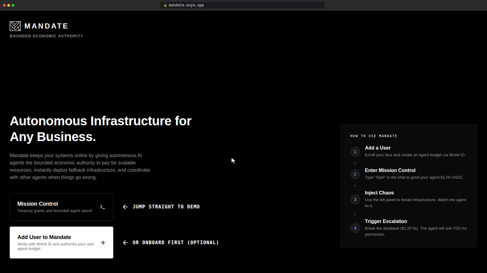

Mission Control. Left panel generates real load,
right panel injects real faults, the middle is the agent thinking out loud.

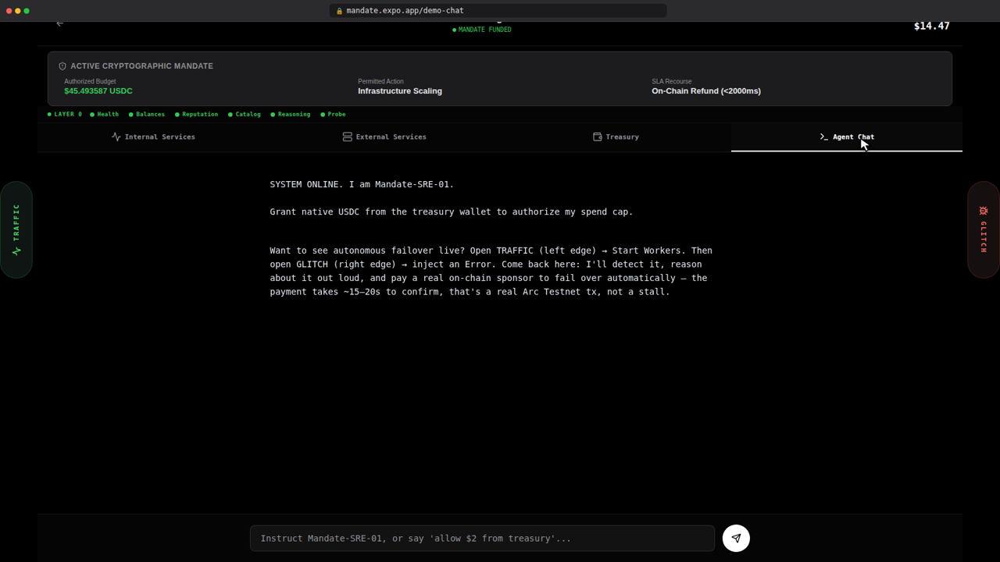

**The signature moment.** The Fault Injector still reads `ERROR` — the
first-party service is still broken — yet the traffic log has gone green,
because the agent detected the outage, paid a sponsor on-chain, and rerouted
through it. Note the agent's own reasoning in the middle, and that a
hosting-plan throttle is labelled as such instead of being passed off as an
infrastructure failure.

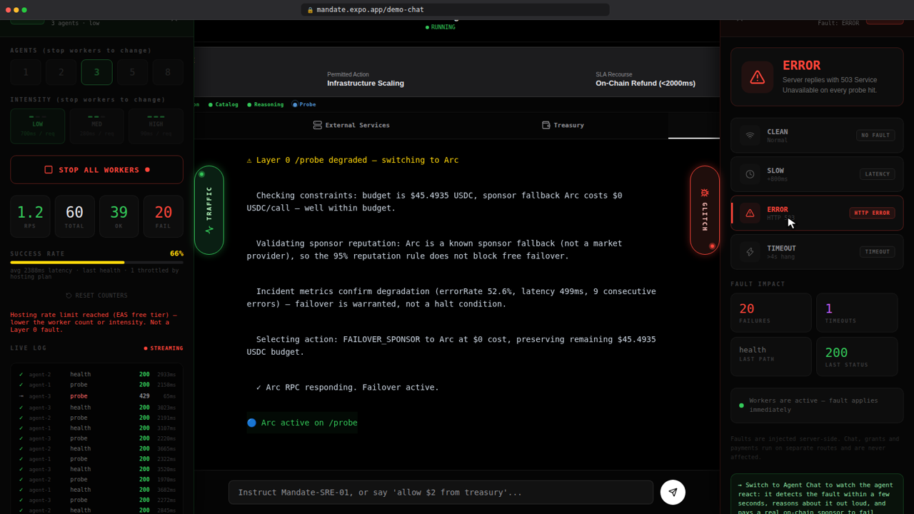

**The sponsor actually serving.** The Graph is active on `/health`, Arc RPC on
`/probe` — with the real per-call price the agent agreed to pay.

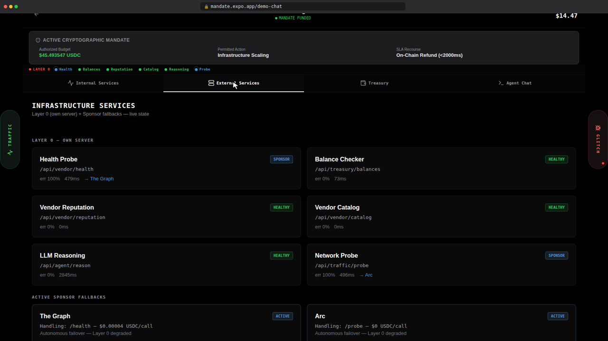

**The receipt.** Every failover payment resolves on Arcscan: a real ERC-4337
`handleOps`, real USDC moved to the sponsor's address, real block.

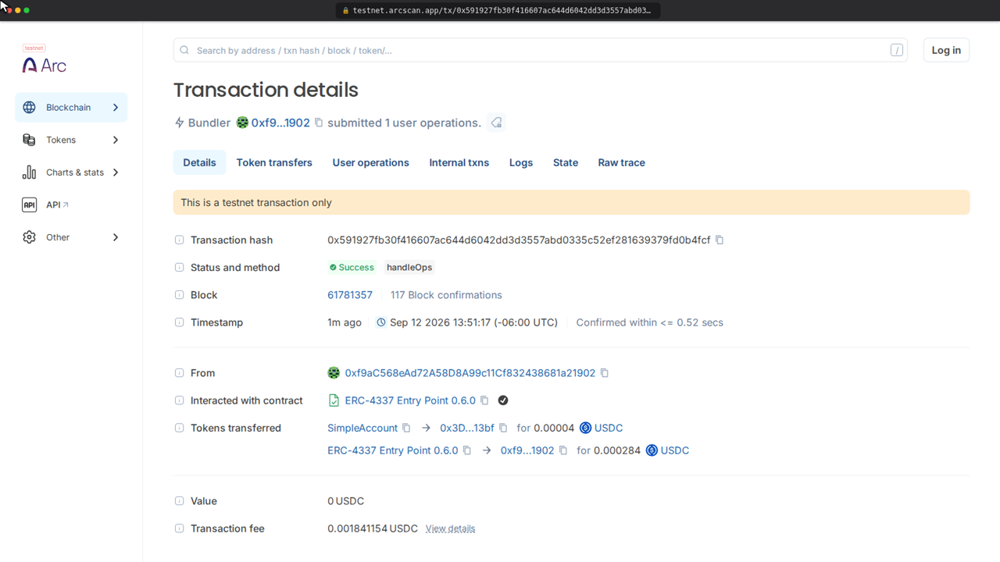

<a id="quick-guide"></a>

## 🚀 Quick guide — break it yourself in 60 seconds

Open **https://mandate.expo.app** and:

1. **Enter Mission Control.** The header shows the agent's live on-chain budget — that number is a real Arc Testnet wallet balance, not a counter.
2. **Open `TRAFFIC`** (left edge) → press **START WORKERS**. Every row that appears is a real HTTP request with its own real status and timing.
3. **Open `GLITCH`** (right edge) → press **ERROR / HTTP 503**. You just broke a first-party service for real, for everyone — including `curl`.
4. **Watch the middle.** Within seconds the agent notices, reasons out loud about cost against its budget, pays a sponsor on-chain, and posts the transaction hash.
5. **Watch the traffic log go green *while the fault is still on*.** That is the whole thesis: the traffic recovered because the agent bought a way out, not because the problem stopped.
6. **Press `CLEAN`.** The first-party service returns, the agent confirms recovery over 5 clean probes and stops paying the sponsor.
7. **Tap any `Tx: 0x…`** to open the real transaction on Arcscan.

Want the escalation path instead? Ask the agent in chat to hire a vendor that
costs more than its budget (`ResilientDB`, $1.20) — it will halt and demand a
World ID Selfie Check before a single cent moves.

The landing page carries its own four-step walkthrough that starts one step
earlier — onboarding with World ID and granting the agent its first dollar. Both
paths work; the agent already holds a funded budget, so the steps above skip
straight to breaking things.

<a id="how-it-works"></a>

## How it works

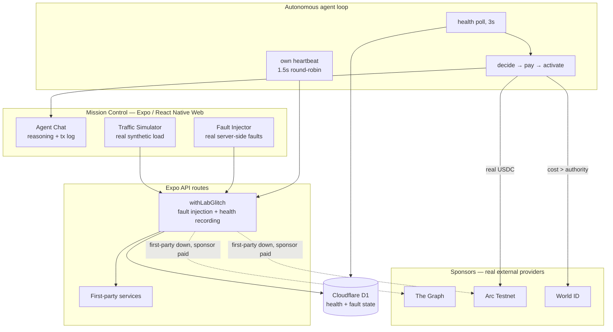

Fault injection and health recording live in **one server-side wrapper** that
every first-party route passes through. That is what makes the fault real: it is
not a client-side visual filter, and it applies to whoever calls the service.

### The loop, per service

Each tracked service owns its own state. There is no global switch.

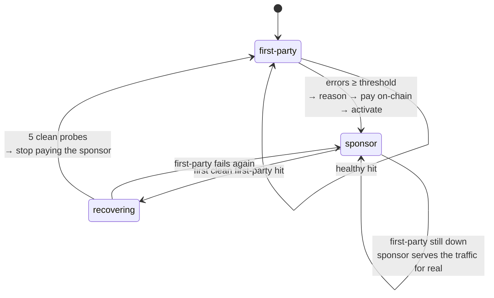

| Service | Trips after | Sponsor | Cost / call |
| :--- | ---: | :--- | ---: |
| `health` | 2 consecutive errors | **The Graph** — chain-head liveness | $0.00004 |
| `probe` | 3 consecutive errors | **Arc** — direct RPC | $0 |
| `balances` | 3 consecutive errors | **Arc** — direct RPC | $0 |
| `reputation` | 2 consecutive errors | **The Graph** — subgraph query | $0.00004 |

**Three independent systems.** The load generator, the fault injector and the
agent are decoupled on purpose: a fault injected with the Traffic panel *closed*
is still detected and repaired, because the agent runs its own heartbeat.
Measured on the deployed build with the panel never opened: `health` failed over
at ~23s, `probe` at ~28s, including a real on-chain payment.

Two services are deliberately **exempt** from fault injection, for the same
reason — you cannot chaos-test the faculty you need in order to respond:
`reason` is the agent's cognition, and `balances` is how it reads its own
solvency. Faulting `balances` deadlocks by construction (we confirmed it: the
agent reads `$0.0000`, then refuses its own recovery as unaffordable — including
the *free* sponsors — and can never read its budget until it fails over, and
never fails over until it can read its budget). Both stay monitored and
sponsor-backed; they are simply not the fault's victim.

---

## Why the sponsors *are* the system

"Sponsor" means the same thing in both senses here. In the architecture, a
sponsor is a real external provider the agent **pays** to take over a degraded
internal service. Those providers are The Graph, Arc and World. Remove any one
and a specific step of the loop stops working:

| Step | Carried by | Remove it and… |
| :--- | :--- | :--- |
| Decide who is worth paying | **The Graph** (own subgraph) | the agent pays failing providers |
| Keep serving `/health` when the first-party service is down | **The Graph** (Gateway liveness) | the paid failover has nowhere to go |
| Halt a risky payment before it is signed | **The Graph** (indexer-lag risk score) | the agent transacts on data it cannot vouch for |
| Move the money | **Arc / Circle** (ERC-4337 + USDC) | there is no payment, only an intent |
| Keep serving `/balances` and `/probe` | **Arc** (direct RPC) | the agent goes blind to its own solvency |
| Act above its own authority | **World ID** (Selfie Check) | the agent either stalls forever or overspends |

<a id="the-graph"></a>

### 🔷 The Graph — the agent's source of truth

Three distinct decision points, none of them a read-only display.

**1. Reputation that gates real money.** We deployed our own subgraph indexing
`EntryPoint.UserOperationEvent` on Arc Testnet (chain `5042002`), decoding each
event's underlying `SimpleAccount.execute(dest, value, func)` calldata down to
the real vendor address and amount actually paid, aggregated into per-vendor
success/failure reputation. It is the **top-priority** source in
`/api/vendor/reputation` (`reputationSource: "live_subgraph"`), ahead of the D1
ledger and the static catalog — and it is what the hiring decision reads before
paying anyone.

> **A finding worth passing upstream:** `graph-node`'s generic
> `ethereum.decode()` cannot decode a dynamic array of tuples with more than one
> dynamic field per element — confirmed against a real Arc Testnet transaction
> where it returned `null` on calldata `ethers.js` decodes correctly.
> `subgraph/src/mapping.ts` walks the Solidity ABI head/tail layout by hand
> instead (`decodeVendorPayment`), verified byte-offset-by-byte in plain Node
> before touching AssemblyScript.

**2. A risk score that can stop a payment.** `graphService.js` queries the
decentralized Network Gateway and derives an indexer-lag risk score from
`_meta.block.timestamp` — how many seconds behind chain head a real indexer
actually is on that call, not a constant. When it returns
`REQUIRE_HUMAN_REVIEW`, the payment halts before it is signed.

> **Two subgraphs, and we're explicit about which is which.** The reputation
> that gates payment comes from **our own** subgraph above. The freshness signal
> in **2** and **3** is read from a large public subgraph (Uniswap V3 mainnet)
> through the Gateway, because a continuously-indexed subgraph is what makes
> indexer lag a meaningful reading — a low-traffic subgraph would look "stale"
> simply for lack of events. We consume it as an oracle; we don't claim it.

**3. Liveness the agent pays for.** When `health` degrades, the fallback is a
real Gateway query for the latest indexed block. `/api/health` is then genuinely
served by The Graph (`servedBy: "The Graph (sponsor)"`, live `blockNumber`) for
$0.00004 USDC per call, paid on-chain. If the Gateway can't return a block, the
sponsor **fails** rather than reporting `online` — no block, no proof.

```bash
curl -X POST https://api.studio.thegraph.com/query/1758530/mandate-vendor-reputation/v0.0.4 \
  -H "Content-Type: application/json" \
  -d '{"query":"{ vendorReputations(first:5, orderBy:totalOps, orderDirection:desc){ id totalOps successCount failureCount successRate } }"}'
```

The counts are live and keep climbing as the demo runs — the top vendor was at
`2,220` indexed operations when the screenshot below was taken, so expect a
larger number, not the same one. The same values surface in
`/api/vendor/reputation` as `reputationSource: "live_subgraph"`.

**The deployed subgraph in Subgraph Studio** — version, sync status, and the
query URL this README points at.

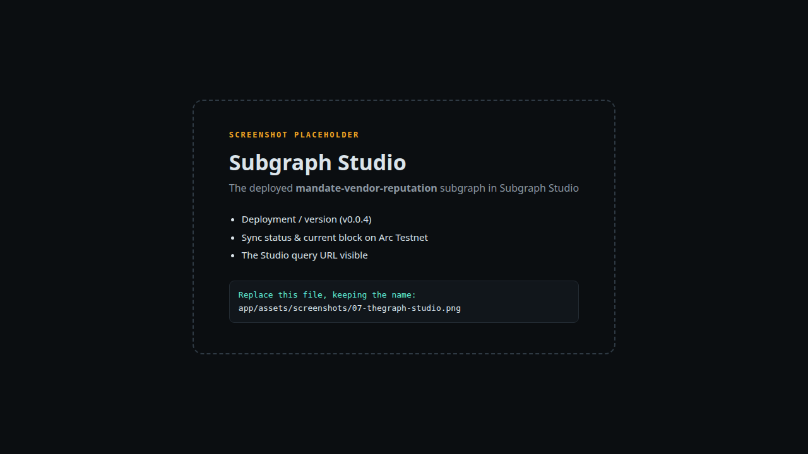

**The same query in the playground**, returning real indexed reputation rows:

```graphql
{
  vendorReputations(first: 5, orderBy: totalOps, orderDirection: desc) {
    id
    totalOps
    successCount
    failureCount
    successRate
  }
}
```

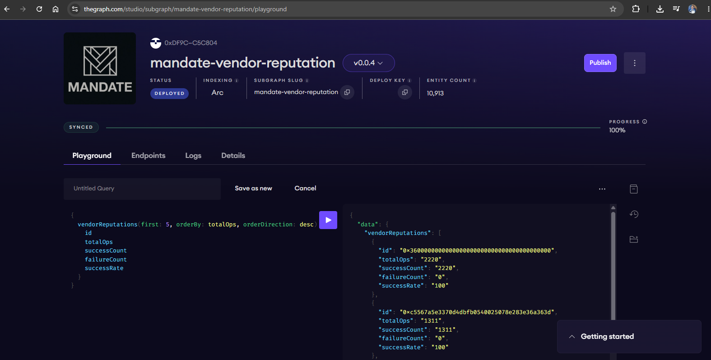

**The Network Gateway API key** behind the live liveness sponsor and the
indexer-lag risk score. The `1.8K` queries and the GRT query fees on it are the
agent's own traffic — every `health` call served by The Graph during an outage
goes through this key.

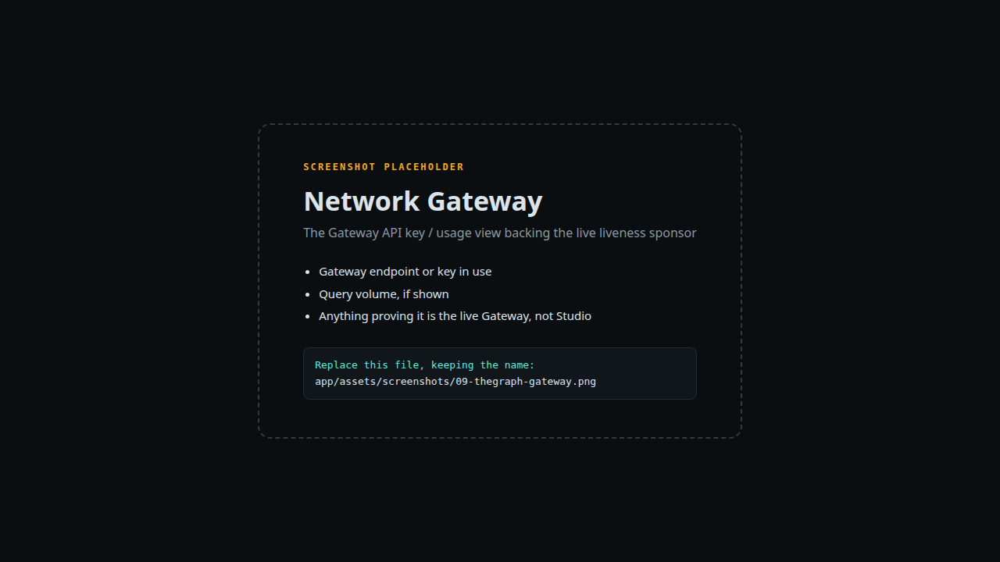

<a id="arc"></a>

### 🔶 Arc / Circle — the settlement rail *and* a sponsor

- **Real ERC-4337 account abstraction** against Arc Testnet's EntryPoint
  (`0x5FF137D4b0FDCD49DcA30c7CF57E578a026d2789`): UserOp construction, signing,
  gas sponsorship through our own Paymaster Worker, real native-USDC transfers.
- **Nanopayment-scale service payments.** Sponsor activation costs **$0.00004
  USDC** — a genuine per-call price for a service, not a rounded demo figure.
- **Bounded authority, enforced.** Every payment is checked against the agent's
  real on-chain granted budget. A treasury grant is a real transfer from the
  treasury wallet to the agent wallet; the "authorized budget" in the UI *is*
  that wallet's live balance.
- **Arc as a sponsor.** When `balances` or `probe` degrade, the fallback is a
  direct Arc RPC call bypassing the failing proxy layer. Cost $0 — and the
  agent's reasoning says so out loud: a good failover is not always a purchase.

Live treasury — these are on-chain wallet balances read through Arc RPC, shown
at six decimals because sub-cent sponsor payments have to survive display
without rounding to `$0.00`:

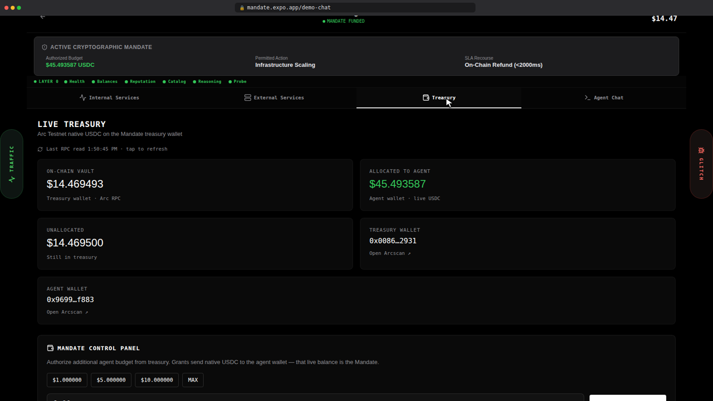

Every `Tx: 0x…` in Agent Chat resolves on [Arcscan](https://testnet.arcscan.app)
— real value, real block, real timestamp.

#### Circle products this runs on

The track asks for effective use of Circle's developer tools. These are the ones
Mandate actually runs on — not referenced, *used*, on every transaction in the
demo:

| Circle core product | | How it is used |
| :--- | :---: | :--- |
| **Arc** | ✅ | Every transaction settles on Arc Testnet (`5042002`) — grants, sponsor activations, vendor payments |
| **USDC** | ✅ | Real native USDC, down to $0.00004 per sponsor call |
| **Paymaster** | ✅ | We built and deployed **our own** ([`app/paymaster-worker/`](app/paymaster-worker)) to sponsor gas for the agent's UserOps |
| Nanopayment-scale flows | ◐ | The pattern, not Circle's product: per-call service payments at $0.00004 |
| Agent Stack · App Kits · Circle Wallets · Circle Contracts | ❌ | Not used — see below |

**Where we built instead of consuming.** At the account-abstraction layer we
implemented the primitives rather than calling an SDK: UserOp construction and
signing directly against the EntryPoint with `ethers.js`, and our own deployed
Paymaster for gas sponsorship. For an agent that signs payments autonomously,
being able to audit the exact bytes it puts on-chain was worth more to us than
the abstraction — and it is why every claim on this page can be checked down to
a transaction. Circle's Agent Stack SDK is therefore not part of the build.

<a id="world"></a>

### 🌍 World ID — the boundary on autonomy

Selfie Check is what makes *bounded* authority mean something. Without a
human-verification gate, an agent that hits its ceiling has two options and both
are bad: stall, or overspend.

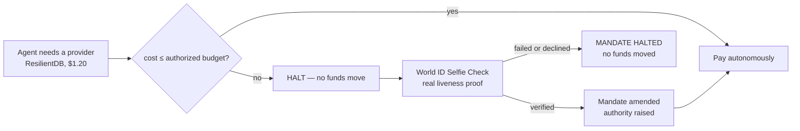

Selfie Check runs at two real points — judge onboarding and the Mission Control
escalation gate — both verified against `developer.world.org`'s real verify API,
with anti-replay nullifier locks. A failed check **cannot** reach the step it
gates. App ID `app_11a0069f40eddb35899a9ec904f3e441`, RP ID
`rp_b741b56a51172a0d`, action `mandate-operator-auth`.

This is Selfie Check as an **authorization and abuse-prevention signal**, not a
login: the question is not *who are you*, it is *is a real human present to raise
this agent's spending authority right now.*

<a id="world-feedback"></a>

#### World ID — developer feedback

*Required by the track, and genuinely meant — this is what we hit building it.*
*Extended version, plus feedback on every other integration and the exact code to review for each:* **[`FEEDBACK.md`](FEEDBACK.md#world-id)**.

**Selfie Check docs & integration flow.** The IDKit v4 separation between the
React component and server-side verification is clear, and the zero-knowledge
explanation is best-in-class. Two gaps: the docs blur `verification_level:
"device"` and the `selfieCheckLegacy` preset — a quickstart table stating that
`device` is the low-friction level to develop against *before* Sandbox access is
granted would remove real hesitation. And React Native / Expo developers need
the explicit deep-link schema (`worldapp://verify?action=…&app_id=…`) plus
expected callback params to build a custom mobile trigger; the web modal is
documented, the mobile trigger is not.

**Developer Portal.** Registering the App ID and action took under three
minutes, and dashboard visibility into verification volume is good. Two asks:
RP keypair management would benefit from an in-portal signature/curl generator,
and gating Selfie Check Sandbox access behind a Google Form is a hard blocker in
a 48-hour event — a Stripe-style "test mode" toggle would change adoption
materially.

**Sandbox, proof flows and edge cases.** The Sandbox App is invaluable for
testing without an Orb. Two things we had to solve ourselves: **nullifier
reuse** — a multi-step agent can retry with the same proof payload, so we
implemented explicit nullifier tracking (`SecurityService.isNullifierReused()`)
to block replay; and **desktop judges without World App installed**, where the
QR flow becomes a dead end — we added a clearly-labelled sandbox fallback so an
evaluator can exercise the escalation pipeline end to end regardless of device.

**What was confusing or hard to test.** The v3 → v4 prop changes need a
migration table mapping how to request Device vs Selfie vs Orb credentials —
that cost us hours. And testing document- vs device-based proofs *before*
Sandbox whitelisting arrived was not possible, so our backend normalises both
into one tier.

<a id="verify"></a>

## 🔍 Verify it yourself — no trust required

Mission Control could be a canned animation. It is not, and none of this
requires believing the UI.

| Claim | Check |
| :--- | :--- |
| The fault is real server state | `curl -X POST https://mandate.expo.app/api/traffic/glitch -H "Content-Type: application/json" -d '{"mode":"error"}'` then `curl https://mandate.expo.app/api/health` → real `503` |
| It applies to everyone, not just the demo | The `curl` above uses no browser and no special header |
| Traffic is real HTTP | DevTools → Network: every row in the log is a real request with its own status and timing |
| Health state is real and shared | `curl https://mandate.expo.app/api/infra/status` returns the state the UI renders |
| Counters are live, not hardcoded | `curl https://mandate.expo.app/api/traffic/stats`, run traffic, curl again — the totals move |
| Payments are real | Every `Tx: 0x…` opens on Arcscan; the same payment appears in our own subgraph |
| The risk score is measured, not constant | `curl -X POST https://mandate.expo.app/api/graph/context` twice — `blockNumber` advances and `indexerLagSeconds` moves. Every field is what the Gateway returned or `null`; nothing is defaulted |

Clear the fault when you are done — `curl -X POST
https://mandate.expo.app/api/traffic/glitch -H "Content-Type: application/json"
-d '{"mode":"off"}'` — though you do not have to: a Cloudflare Worker on a cron
trigger (`app/janitor-worker/`) returns the demo to a pristine state once it has
been idle for 20 minutes, so nobody ever lands on someone else's leftover fault.
It only counts *human* activity — injecting a fault, or running the simulator —
so it will not reset out from under you mid-evaluation, and it deliberately
ignores the agent's own heartbeat, which would otherwise keep a forgotten
browser tab looking busy forever.

---

## Track requirement mapping

**The Graph — Best AI Tooling or AI Use Case (Start Fresh pool)**

| Requirement | Where it is satisfied |
| :--- | :--- |
| The Graph is load-bearing | Reputation gates who gets paid; the risk score can halt a payment; the Gateway is the paid sponsor serving `/health` during an outage |
| Live data from a Graph provider | Own deployed subgraph on Arc Testnet + live Network Gateway queries. No mocked or static datasets in these paths |
| Meaningful work with the data | Autonomous hiring against a ≥95% trust threshold, a pre-payment risk gate, live failover routing |
| Open source, public repo, README, 2–4 min video | This repository and this README; subgraph source in [`subgraph/`](subgraph) |
| Correct pool | **Start Fresh** — net-new during the hackathon |

**Arc — Best Agentic Economy Application with Circle Agent Stack**

| Requirement | Where it is satisfied |
| :--- | :--- |
| Decision logic tied to real signals | Failover driven by measured error rate, consecutive errors and latency, plus live budget and on-chain reputation |
| Autonomous spending / settlement in USDC | Real native-USDC ERC-4337 transfers: sponsor activation, vendor hiring, SLA refunds, treasury grants |
| Paymaster / nanopayment flows | Our own Paymaster Worker sponsors gas; sponsor activation is a $0.00004 USDC per-call payment |
| Functional MVP + architecture diagram | Live at [mandate.expo.app](https://mandate.expo.app); diagrams above |
| Video + detailed documentation | Demo videos + this README |
| Effective use of Circle's developer tools | **Arc**, **USDC** and our **own deployed Paymaster** — product-by-product accounting in the [Arc section](#arc) |

**World — Selfie Check**

| Requirement | Where it is satisfied |
| :--- | :--- |
| Uses Selfie Check meaningfully | Two real gates: onboarding and the economic-authority escalation, both against the real verify API with anti-replay nullifiers |
| Treated as a risk / eligibility / abuse-prevention signal | It is the boundary on autonomous spending — above its authority the agent halts and cannot proceed |
| Feedback document | [Above](#world-feedback) |
| Working app | [mandate.expo.app](https://mandate.expo.app) |

---

## Integration feedback

Building this meant fighting several of these platforms in ways worth writing
down — a `graph-node` decoder that cannot decode ERC-4337 calldata, D1 read
replicas serving 25-second-stale data with no consistency knob on the REST API,
a hosting throttle returning HTML into a `fetch()`, and a handful of mistakes
that were entirely our own.

**[`FEEDBACK.md`](FEEDBACK.md)** is the full engineering log, organised per
technology. Each section opens with the **exact files to read** for that
integration, so a reviewer can see what was implemented without taking any of
it on trust:
[The Graph](FEEDBACK.md#the-graph) ·
[Arc / Circle](FEEDBACK.md#arc) ·
[World ID](FEEDBACK.md#world-id) ·
[Cloudflare D1](FEEDBACK.md#cloudflare) ·
[EAS Hosting & Expo](FEEDBACK.md#eas) ·
[React Native Web](FEEDBACK.md#rnw) ·
[our own mistakes](FEEDBACK.md#our-mistakes).

---

## Honest accounting

Nothing here is hidden elsewhere in the repo, so it may as well be said plainly.

**Choices that could be mistaken for gaps.** Each of these is deliberate, and
the reasoning matters more than the decision:

- **`catalog` and `reputation` are exempt from fault injection.** No sponsor
  implementation is wired for them, and breaking a path with no recovery route
  would show a "sponsor active" badge over a recovery that cannot happen. We
  only break what the agent can genuinely repair.
- **`reason` and `balances` are exempt too** — the agent's cognition and its
  solvency. You cannot chaos-test the faculty you need in order to respond;
  faulting solvency deadlocks the agent outright, which we proved by doing it.
- **Traffic Simulator counters are per-session.** The panel counts the outcomes
  its own requests actually received, which is immune to D1 read-replica lag.
  The durable, cross-session, judge-checkable record stays server-side at
  `/api/traffic/stats`.
- **The indexer-lag oracle reads someone else's subgraph, on purpose.** Lag is
  only a meaningful reading on a subgraph that indexes continuously, so
  `graphService.js` measures it against Uniswap V3 mainnet through the Gateway.
  Our own subgraph is what gates payment; this one is a clock. Both are labelled
  as such in the code.

**One thing we had to go back and fix.** `graphService.js` used to fall back to
hardcoded values — a block number, a hash, a `trustScore: 99.2` — whenever the
Gateway didn't answer, and still reported `SUCCESS_LIVE_INDEXED`. It was
invisible because the Gateway rarely fails, but it meant a Gateway outage could
have served a stale block as *proof of liveness*. Every field is now either what
the Gateway actually returned or `null`, the invented account/merchant stats are
gone entirely (nothing consumed them), and a Gateway outage now fails **closed**:
`REQUIRE_HUMAN_REVIEW` for the payment gate, and a sponsor that reports failure
instead of `online`.

**An operational ceiling, not a product one.** The deployment runs on EAS
Hosting's free tier, which throttles sustained request rates and returns `429`
with an HTML body. Three simulator workers at HIGH intensity run clean; five
cross the limit. The panel labels throttled hits as *hosting-throttled* and
excludes them from the failure count, so a **billing ceiling never masquerades
as infrastructure failing** — which is the same standard we hold the rest of the
system to.

---

## Run it locally

```bash
npm install
npm --prefix app install
npm run web          # http://localhost:8081
```

Environment variables and the security model are documented in
[`.env.example`](.env.example). Secrets are server-only: no private key,
API key or RP key is ever exposed to the client, and every API route is
CORS-gated with per-IP rate limiting on the money-moving endpoints.

## Repository layout

```
app/          The application — Expo Router frontend + server API routes,
              Paymaster, x402 vendor and janitor Workers, screenshots
subgraph/     Our deployed subgraph: schema, hand-rolled ABI decoder, tests
AGENTS.md     Machine-readable brief for AI agents reviewing this repo
FEEDBACK.md   Integration feedback + engineering log, with code pointers
README.md     You are here — the main documentation
```

---

*Built for ETHGlobal. Live at **https://mandate.expo.app** · Chain: Arc Testnet (`5042002`) · Explorer: [Arcscan](https://testnet.arcscan.app)*
