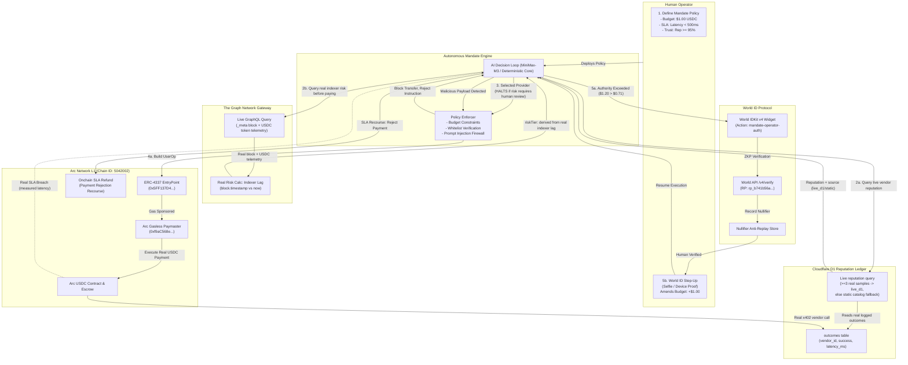
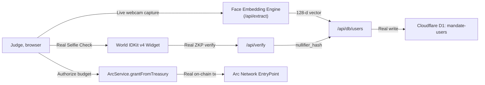
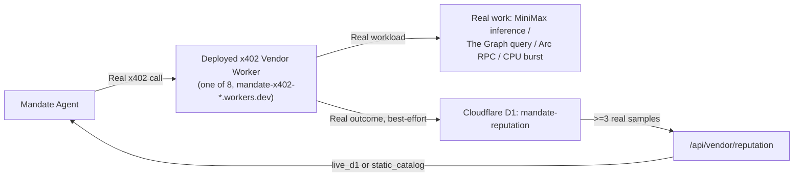

# Mandate: System Architecture & Data Flow

**Mandate** is an authorization, payment, and recourse engine for autonomous commerce. It provides **Bounded Economic Authority** for AI agents, built on:
- **Arc Network** (ERC-4337 Account Abstraction & USDC Gasless Settlement)
- **The Graph Protocol** (real Network Gateway queries drive a real risk score that gates payments)
- **Cloudflare Workers + D1** (a real, deployed multi-vendor marketplace with a live reputation ledger)
- **World ID** (Selfie Check for judge onboarding and high-risk human escalation)

---

## 1. Mission Control Architecture ($1 Survival Test)

---

## 2. Judge Onboarding Architecture (Face + World ID Enrollment)

---

## 3. Vendor Marketplace Architecture (Cloudflare Workers + D1)

---

## 4. Our Own Deployed Subgraph (`subgraph/`, Arc Testnet)

This is the highest-priority reputation source — a real subgraph we wrote and
deployed to Subgraph Studio, indexing the shared EntryPoint contract
(`0x5FF137D4b0FDCD49DcA30c7CF57E578a026d2789`) on Arc Testnet, independent of
anything our own backend controls:

```mermaid
flowchart LR
    Pay["Agent pays a vendor<br/>(real ERC-4337 UserOp)"] -->|Real tx| EP["EntryPoint.handleOps(...)<br/>on Arc Testnet"]
    EP -->|Real UserOperationEvent| Indexer["mandate-vendor-reputation subgraph<br/>(Subgraph Studio)"]
    Indexer -->|"Manual ABI decode of the nested<br/>SimpleAccount.execute(dest,value,func) call"| Decode["Real vendor + amount<br/>(not trusted from our backend)"]
    Decode -->|Aggregate per vendor| VendorRep["VendorReputation entity"]
    VendorRep -->|>=3 real on-chain samples| RepApi["/api/vendor/reputation"]
    RepApi -->|live_subgraph, highest priority| Agent2["Mandate Agent decision"]
```

**Why a manual decode:** `graph-node`'s generic `ethereum.decode()` cannot
decode a dynamic array of tuples where the tuple itself has more than one
dynamic field — confirmed empirically (`ethereum.decode` returned `null` on
real `handleOps` calldata that `ethers.js` decodes correctly). `subgraph/src/mapping.ts`
walks the standard Solidity ABI head/tail byte layout by hand instead —
verified against a real Arc Testnet transaction before deploying (see the
`decodeVendorPayment` function's comment for the exact byte offsets checked).

**Reputation priority chain** (`/api/vendor/reputation`, never silently
blended — `reputationSource` says exactly which tier produced the number):
`live_subgraph` (our own deployed subgraph, independently verifiable by
anyone — not writable by us) → `live_d1` (real outcomes, but logged by our
own Workers) → `static_catalog` (cold-start fallback, no real samples yet).

---

## 5. Technology & Protocol Integration Matrix

| Protocol Track | Implemented Technology | Verification Proof |
| :--- | :--- | :--- |
| **Arc Network** | ERC-4337 Account Abstraction, Paymaster gas sponsorship, conditional spending, and onchain SLA refunds. | Dispatches live transactions and SLA refunds to Arc Testnet (`Chain ID: 5042002`). |
| **The Graph** | Two independent real integrations: (1) our own deployed subgraph (`subgraph/`) indexing Arc Testnet's EntryPoint, decoded down to real per-vendor payment reputation — the highest-priority source for hiring decisions; (2) Gateway GraphQL queries (real block + USDC telemetry) drive a real risk score (indexer lag) that gates real vendor payments. | Subgraph: `https://api.studio.thegraph.com/query/1758530/mandate-vendor-reputation`, verified against real Arc Testnet transactions. Gateway: live queries to `gateway.thegraph.com`; `agentService.js`'s `processAdminCommand` halts a real payment when `riskEvaluation.recommendation === 'REQUIRE_HUMAN_REVIEW'`. |
| **World ID** | Device / Selfie Check zero-knowledge proof for judge onboarding and for high-risk economic authority escalation, with anti-replay nullifier locks. | Uses registered App ID `app_11a0069f40eddb35899a9ec904f3e441` and RP ID `rp_b741b56a51172a0d`. |
| **Cloudflare Workers + D1** | 8 real deployed x402 vendor Workers, each doing real work (MiniMax inference, Graph query, Arc RPC, CPU burst); real outcomes logged to D1 as the second-priority reputation tier. | `mandate-x402-*.workers.dev`; `mandate-reputation` and `mandate-users` D1 databases. |
| **ENS** | Hierarchical human-readable agent namespace pointer (`mission.mandate.eth`) — supporting integration, not load-bearing to any decision. | Not currently wired into a live code path. |
