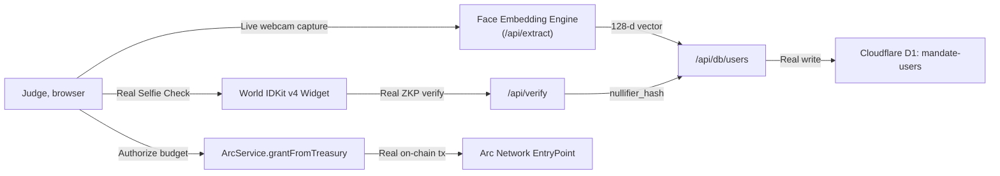
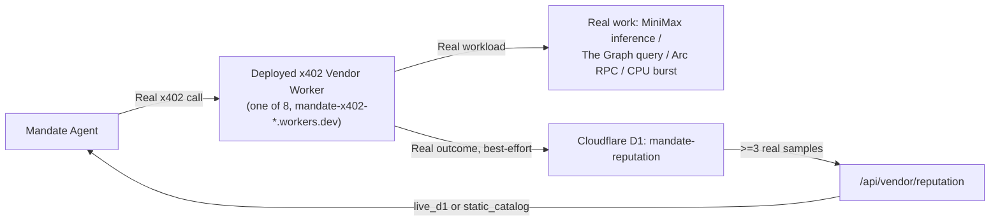

# Mandate: System Architecture & Data Flow

**Mandate** is an authorization, payment, and recourse engine for autonomous commerce. It provides **Bounded Economic Authority** for AI agents, built on:
- **Arc Network** (ERC-4337 Account Abstraction & USDC Gasless Settlement)
- **The Graph Protocol** (real Network Gateway queries drive a real risk score that gates payments)
- **Cloudflare Workers + D1** (a real, deployed multi-vendor marketplace with a live reputation ledger)
- **World ID** (Selfie Check for judge onboarding and high-risk human escalation)

---

## 1. Mission Control Architecture ($1 Survival Test)

```mermaid
flowchart TD
    subgraph HumanOperator ["Human Operator"]
        MandateDef["1. Define Mandate Policy\n- Budget: $1.00 USDC\n- SLA: Latency < 500ms\n- Trust: Rep >= 95%"]
        EscalationApproval["5b. World ID Step-Up\n(Selfie / Device Proof)\nAmends Budget: +$1.00"]
    end

    subgraph AutonomousAgent ["Autonomous Mandate Engine"]
        AgentLoop["AI Decision Loop (MiniMax-M3 / Deterministic Core)"]
        SLAPolicy["Policy Enforcer\n- Budget Constraints\n- Whitelist Verification\n- Prompt Injection Firewall"]
    end

    subgraph TheGraphRail ["The Graph Network Gateway"]
        LiveQuery["Live GraphQL Query\n(_meta block + USDC token telemetry)"]
        RiskCalc["Real Risk Calc: Indexer Lag\n(block.timestamp vs now)"]
    end

    subgraph D1Rail ["Cloudflare D1 Reputation Ledger"]
        Outcomes["outcomes table\n(vendor_id, success, latency_ms)"]
        LiveRep["Live reputation query\n(>=3 real samples -> live_d1,\nelse static catalog fallback)"]
    end

    subgraph ArcSettlement ["Arc Network L1 (Chain ID: 5042002)"]
        EntryPoint["ERC-4337 EntryPoint\n(0x5FF137D4...)"]
        Paymaster["Arc Gasless Paymaster\n(0xf9aC568e...)"]
        UsdcRail["Arc USDC Contract & Escrow"]
        RefundRail["Onchain SLA Refund\n(Payment Rejection Recourse)"]
    end

    subgraph WorldIDRail ["World ID Protocol"]
        IDKit["World IDKit v4 Widget\n(Action: mandate-operator-auth)"]
        RPVerify["World API /v4/verify\n(RP: rp_b741b56a...)"]
        AntiReplay["Nullifier Anti-Replay Store"]
    end

    %% Execution Flows
    HumanOperator -->|Deploys Policy| AgentLoop
    AgentLoop -->|2a. Query live vendor reputation| LiveRep
    LiveRep -->|Reads real logged outcomes| Outcomes
    LiveRep -->|Reputation + source (live_d1/static)| AgentLoop
    AgentLoop -->|2b. Query real indexer risk before paying| LiveQuery
    LiveQuery -->|Real block + USDC telemetry| RiskCalc
    RiskCalc -->|riskTier: derived from real indexer lag| AgentLoop
    AgentLoop -->|3. Selected Provider (HALTS if risk requires human review)| SLAPolicy
    SLAPolicy -->|4a. Build UserOp| EntryPoint
    EntryPoint -->|Gas Sponsored| Paymaster
    Paymaster -->|Execute Real USDC Payment| UsdcRail
    UsdcRail -->|Real x402 vendor call| Outcomes

    %% SLA Breach Flow
    UsdcRail -.->|Real SLA Breach (measured latency)| AgentLoop
    AgentLoop -->|SLA Recourse: Reject Payment| RefundRail

    %% Prompt Injection Flow
    AgentLoop -->|Malicious Payload Detected| SLAPolicy
    SLAPolicy -->|Block Transfer, Reject Instruction| AgentLoop

    %% Human Escalation Flow
    AgentLoop -->|5a. Authority Exceeded ($1.20 > $0.71)| IDKit
    IDKit -->|ZKP Verification| RPVerify
    RPVerify -->|Record Nullifier| AntiReplay
    AntiReplay -->|Human Verified| EscalationApproval
    EscalationApproval -->|Resume Execution| AgentLoop
```

---

## 2. Judge Onboarding Architecture (Face + World ID Enrollment)



---

## 3. Vendor Marketplace Architecture (Cloudflare Workers + D1)



---

## 4. Technology & Protocol Integration Matrix

| Protocol Track | Implemented Technology | Verification Proof |
| :--- | :--- | :--- |
| **Arc Network** | ERC-4337 Account Abstraction, Paymaster gas sponsorship, conditional spending, and onchain SLA refunds. | Dispatches live transactions and SLA refunds to Arc Testnet (`Chain ID: 5042002`). |
| **The Graph** | Gateway GraphQL querying (real block + USDC token telemetry) drives a real risk score (indexer lag) that gates real vendor payments — not a fixed constant. | Live queries sent to `gateway.thegraph.com` with API Key; `agentService.js`'s `processAdminCommand` halts a real payment when `riskEvaluation.recommendation === 'REQUIRE_HUMAN_REVIEW'`. |
| **World ID** | Device / Selfie Check zero-knowledge proof for judge onboarding and for high-risk economic authority escalation, with anti-replay nullifier locks. | Uses registered App ID `app_11a0069f40eddb35899a9ec904f3e441` and RP ID `rp_b741b56a51172a0d`. |
| **Cloudflare Workers + D1** | 8 real deployed x402 vendor Workers, each doing real work (MiniMax inference, Graph query, Arc RPC, CPU burst); real outcomes logged to D1 compute live vendor reputation. | `mandate-x402-*.workers.dev`; `mandate-reputation` and `mandate-users` D1 databases. |
| **ENS** | Hierarchical human-readable agent namespace pointer (`mission.mandate.eth`) — supporting integration, not load-bearing to any decision. | Not currently wired into a live code path. |
