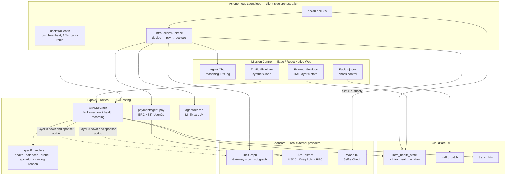
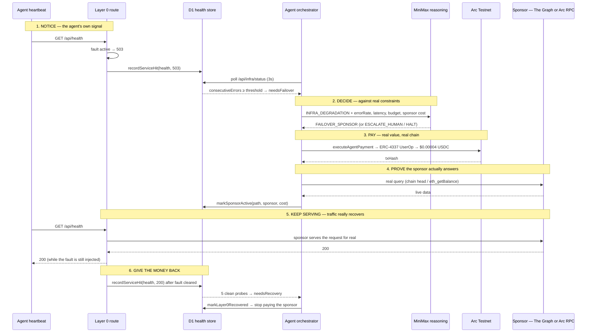
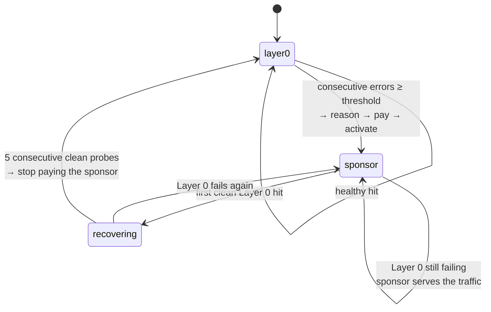
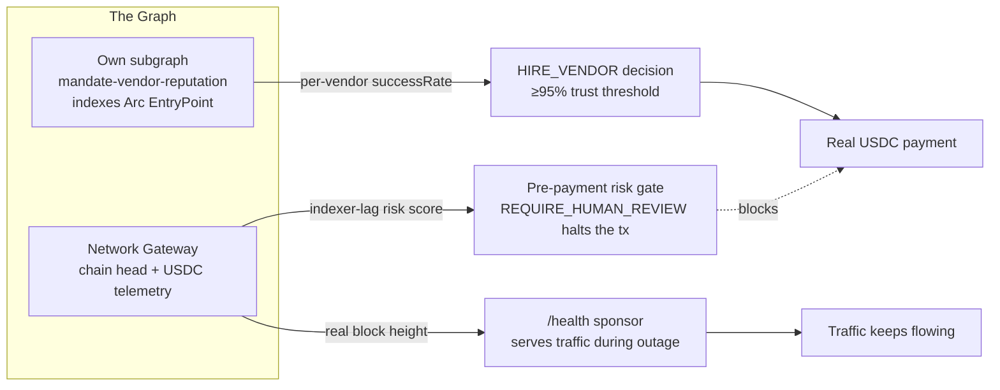
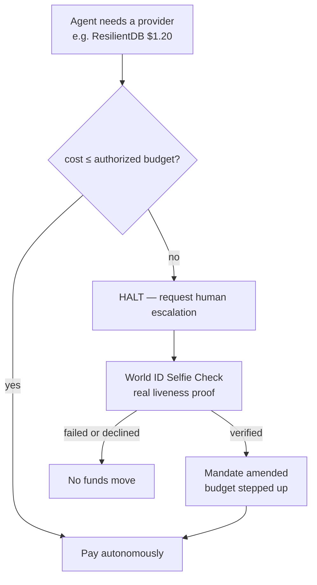

# Mandate — Technical Documentation

> How the system works, why each sponsor integration is load-bearing rather
> than decorative, and how to independently verify every claim below.

Companion documents: [`README.md`](../README.md) (product story) ·
[`JUDGING.md`](../JUDGING.md) (per-track verification commands) ·
[`ARCHITECTURE.md`](ARCHITECTURE.md) (Mission Control, onboarding and vendor
marketplace diagrams) · [`SECURITY.md`](../SECURITY.md) (threat model, env
vars) · [`WORLD_ID_FEEDBACK.md`](WORLD_ID_FEEDBACK.md) (World developer
feedback).

---

## 1. The problem

Give an autonomous agent a wallet and it can pay. That is the easy half, and
it is the half most agent-payment work stops at. The hard half starts the
moment the agent has to answer questions a wallet cannot:

- **When am I allowed to spend?** A model that hallucinates a price, or loops
  on a retry, spends real money at machine speed.
- **Who am I allowed to pay?** An agent with no reputation signal will happily
  pay whoever answered the request, including a provider that is failing.
- **What do I get back?** Without delivery verification, "paid" and "served"
  are unrelated events.
- **What happens when I am wrong?** Refunds, failover and escalation are the
  actual product; the payment is the trivial part.

Mandate is that missing half: an authorization, payment and recourse layer.
The demo puts it under load deliberately — a real agent, with a real budget,
running on infrastructure that is really broken while it works.

### The specific failure this system is built to survive

An agent's own infrastructure ("Layer 0" — the services it depends on to
answer requests) degrades. The agent must, without a human in the loop:

1. **Notice** — on its own signal, not because someone was watching a dashboard.
2. **Decide** — against real constraints: current budget, provider cost, provider reputation.
3. **Pay** — a real counterparty, on-chain, within an authority it cannot exceed.
4. **Keep serving** — traffic must actually recover, not just a badge turning green.
5. **Give the money back** — when Layer 0 returns, stop paying the sponsor.
6. **Escalate** — when the fix costs more than its authority allows, stop and ask a verified human.

Every one of those six steps is carried by a sponsor integration. That is the
argument of this document.

---

## 2. The thesis: the sponsors *are* the recovery mechanism

The word "sponsor" carries two meanings here, and they are the same thing.

In the product's architecture, a **sponsor** is a real external provider the
agent pays to take over a degraded internal service. In the hackathon sense,
the **sponsors** are The Graph, Arc/Circle and World. They are not three
integrations bolted onto a demo — remove any one and a specific step of the
loop above stops working:

| Step | Carried by | Remove it and… |
| :--- | :--- | :--- |
| Decide *who* is worth paying | **The Graph** (own subgraph → per-vendor reputation) | the agent pays failing providers; there is no trust signal |
| Keep serving `/health` when Layer 0 is down | **The Graph** (Gateway → real chain-head liveness) | the paid failover has nowhere to fail over *to* |
| Halt a risky payment before it happens | **The Graph** (Gateway → indexer-lag risk score) | the agent transacts on data it cannot vouch for |
| Move the money | **Arc / Circle** (ERC-4337 + native USDC) | there is no payment, only an intent |
| Keep serving `/balances` and `/probe` | **Arc** (direct RPC as sponsor) | the agent goes blind to its own solvency |
| Act above its own authority | **World ID** (Selfie Check gate) | the agent either stalls forever or overspends |

The rest of this document walks the loop and shows exactly where each one
sits in the code.

---

## 3. System architecture



**Key structural choice:** fault injection and health recording live in one
server-side wrapper, `withLabGlitch`, that every Layer 0 route passes through.
That is what makes the fault *real* — it is not a client-side visual filter,
and it applies to whoever calls the service.

---

## 4. The resilience loop, end to end



The step that matters most is **5**. A failover that flips a badge but leaves
traffic failing has not failed over. In Mandate the sponsor genuinely serves
the request: the caller gets a real `200` from The Graph or Arc RPC *while the
injected fault is still active*, which is visible in the Traffic Simulator's
log turning green with the Fault Injector still reading `ERROR`.

### Per-path state machine

Each tracked path owns its own state; there is no global switch.



Thresholds live in [`app/src/constants/vendors.js`](../app/src/constants/vendors.js):

| Path | Consecutive errors | Error rate | Latency | Sponsor | Cost / call |
| :--- | ---: | ---: | ---: | :--- | ---: |
| `health` | 2 | 40% | 2000ms | **The Graph** (chain-head liveness) | $0.00004 |
| `balances` | 3 | 30% | 1500ms | **Arc** (direct RPC) | $0 |
| `probe` | 3 | 30% | 1500ms | **Arc** (direct RPC) | $0 |
| `reputation` | 2 | 25% | 1200ms | **The Graph** (subgraph query) | $0.00004 |
| `catalog` | 3 | 35% | 1800ms | Built-in static | $0 |
| `reason` | 2 | 20% | 4000ms | Built-in deterministic | $0 |

### Three independent systems

The Traffic Simulator, the Fault Injector and the agent are deliberately
decoupled — a design point that took real work to get right:

- **The fault is not scoped to the demo.** It applies to whoever calls the
  service. `curl https://mandate.expo.app/api/health` returns a real `503`
  while a fault is active, with no browser and no special header.
- **The agent notices on its own.** `useInfraHealth` runs its own heartbeat
  (one tracked service per beat, round-robin), so a fault injected with the
  Traffic panel closed is still detected and repaired. Measured on the
  deployed build with the Traffic panel never opened: `health` reached
  `sponsor` at ~23s and `probe` at ~28s, including a real on-chain payment.
- **The simulator is only a load generator.** It makes the story visible; it
  is not required for any of it. When it is running the heartbeat stays quiet
  and reads its signal instead of adding redundant load.

Two paths are deliberately **excluded** from fault injection, and the reason
is the same in both cases — you cannot chaos-test the faculty you need in
order to respond:

- **`reason`** is the agent's cognition. Injecting a data-plane fault into the
  control plane you are trying to watch respond is backwards. A genuine LLM
  outage is still handled, by `callAgentReason`'s deterministic fallback.
- **`balances`** is how the agent reads its own budget. Faulting it deadlocks
  by construction, which we confirmed directly: the first balance read fails,
  the agent then reasons against `$0.0000` and refuses its own recovery as
  unaffordable — *including the free sponsors* — so it can never read its
  budget until it fails over and never fails over until it can read its
  budget. Solvency is control plane. Both paths stay fully monitored and
  sponsor-backed; they are simply not the fault's victim.

---

## 5. The Graph — the agent's source of truth

The Graph appears at three distinct decision points. None of them is a
read-only display.



**1. Reputation that gates real money.** We deployed our own subgraph indexing
`EntryPoint.UserOperationEvent` on Arc Testnet (chain `5042002`), decoding each
event's underlying `SimpleAccount.execute(dest, value, func)` calldata down to
the real vendor address and amount actually paid, aggregated into per-vendor
success/failure reputation. That is the **top-priority** source in
`/api/vendor/reputation` (`reputationSource: "live_subgraph"`), ahead of the D1
ledger and the static catalog — and it is what the hiring decision in
`agentService.js` reads before paying anyone.

> Worth noting for anyone building on `graph-node`: its generic
> `ethereum.decode()` cannot decode a dynamic array of tuples with more than
> one dynamic field per element — confirmed against a real Arc Testnet
> transaction where it returned `null` on calldata `ethers.js` decodes
> correctly. `subgraph/src/mapping.ts` walks the Solidity ABI head/tail layout
> by hand instead (`decodeVendorPayment`), verified byte-offset-by-byte in
> plain Node before touching AssemblyScript.

**2. A risk score that can stop a payment.** `graphService.js` queries the
Gateway for real chain-head data and derives an indexer-lag risk score from it
— not a constant. When it returns `REQUIRE_HUMAN_REVIEW`, `processAdminCommand`
halts the payment before it is signed.

**3. Liveness the agent pays for.** When `health` degrades, the sponsor is a
real Gateway query for the latest indexed block. Requests to `/api/health`
are then genuinely served by The Graph (`servedBy: "The Graph (sponsor)"`,
with a live `blockNumber`) for $0.00004 USDC per call, paid on-chain.

Verify:

```bash
curl -X POST https://api.studio.thegraph.com/query/1758530/mandate-vendor-reputation/v0.0.4 \
  -H "Content-Type: application/json" \
  -d '{"query":"{ vendorReputations(first:10){ id totalOps successCount successRate } }"}'
```

---

## 6. Arc / Circle — the settlement rail *and* a sponsor

Arc carries the money, and separately carries two of the fallbacks.

- **Real ERC-4337 account abstraction** against Arc Testnet's EntryPoint
  (`0x5FF137D4b0FDCD49DcA30c7CF57E578a026d2789`): UserOp construction, signing,
  gas sponsorship through our own Paymaster Worker, and real native-USDC
  transfers (`erc4337.js`, `payment/agent-pay+api.js`).
- **Bounded authority, enforced.** The agent's spend is checked against its
  real on-chain granted budget before every payment. A treasury grant is a
  real transfer from the treasury wallet to the agent wallet; the "authorized
  budget" in the UI is that wallet's live balance, not a counter.
- **Arc as sponsor.** When `balances` or `probe` degrade, the fallback is a
  direct Arc RPC call that bypasses the failing proxy layer — `eth_getBalance`
  and `eth_blockNumber` respectively. Cost $0, which is exactly why the agent
  can take that decision without spending: a good failover is not always a
  purchase, and the reasoning says so out loud.

Every `Tx: 0x…` in Agent Chat is tappable and resolves on
[Arcscan](https://testnet.arcscan.app) — real value, real block, real
timestamp.

**Honest gap:** this AA layer is hand-rolled with `ethers.js` directly against
the EntryPoint, not built on Circle's named Agent Stack / App Kits SDKs. We
chose that for full transparency over the exact bytes being signed and
submitted, which is auditable in a way an SDK call is not. The track's
qualification requirements (functional MVP + diagram + video + repo) do not
name a required SDK, so this does not affect eligibility — but a judge
specifically looking for Agent Stack usage will not find it, and we would
rather say so than bury it.

---

## 7. World ID — the boundary on autonomy

Selfie Check is what makes "bounded" authority mean something. Without a
human-verification gate, an agent that hits its ceiling has only two options,
and both are bad: stall, or overspend.



Selfie Check runs at two real points — judge onboarding
(`app/src/components/EnrollmentScreen.js`) and the Mission Control escalation
gate — both verified against `developer.world.org`'s real verify API, with
anti-replay nullifier locks. A failed check cannot reach the step it gates:
the escalation path returns `MANDATE HALTED: human escalation declined or
failed — no funds moved`.

This is Selfie Check used as an **authorization and abuse-prevention signal**,
not as a login: the question it answers is not "who are you" but "is a real
human present to raise this agent's spending authority right now".

Developer feedback document: [`WORLD_ID_FEEDBACK.md`](WORLD_ID_FEEDBACK.md).

---

## 8. Why you should not take our word for any of this

Mission Control's panels could be a canned animation. They are not, and none
of the following requires trusting the UI.

| Claim | Independent check |
| :--- | :--- |
| The fault is real server state | `curl -X POST .../api/traffic/glitch -d '{"mode":"error"}'` then `curl .../api/health` → real `503` |
| It affects everyone, not just the demo | The `curl` above uses no browser and no special header |
| Traffic is real HTTP | DevTools → Network: every row in the log is a real request with its own status and timing |
| Health state is shared server-side | `curl .../api/infra/status` from anywhere returns the same state the UI renders |
| Payments are real | Every `Tx: 0x…` opens on Arcscan; the same payment appears in our own subgraph |
| Counters are live, not hardcoded | `curl .../api/traffic/stats`, run traffic, curl again — the totals move |

One more piece of honesty, because it bit us and it is the kind of thing a
judge could otherwise mistake for a bug: the deployment runs on **EAS
Hosting's free tier**, which throttles sustained request rates and returns
`429` with an HTML body (`"This deployment is receiving too many requests…"`).
Three simulator workers at HIGH intensity run clean; five cross the limit. The
panel now labels throttled hits as *hosting-throttled* — excluded from the
failure count, greyed out with their own marker — precisely so a **billing
ceiling never masquerades as infrastructure failing**.

---

## 9. Track rubric mapping

### The Graph — Best AI Tooling or AI Use Case (Start Fresh pool)

| Requirement | How Mandate satisfies it |
| :--- | :--- |
| The Graph is **load-bearing** | Reputation from our own subgraph gates who gets paid; the Gateway risk score can halt a payment; the Gateway is the paid sponsor that serves `/health` during an outage. Remove The Graph and the hiring decision, the risk gate and one of two failover routes all disappear. |
| **Live** data from a Graph provider | Own deployed subgraph (`mandate-vendor-reputation`, Arc Testnet chain `5042002`) plus live Network Gateway queries. No mocked or static datasets in these paths. |
| **Meaningful work** with the data | Autonomous hiring decisions against a ≥95% trust threshold, a pre-payment risk gate that halts real transactions, and live failover routing — not a rendered query result. |
| Open source + README + public repo + 2–4 min video | This repository, [`README.md`](../README.md), and the demo videos. |
| Correct pool | **Start Fresh** — net-new during the hackathon. |

### Arc — Best Agentic Economy Application with Circle Agent Stack

| Requirement | How Mandate satisfies it |
| :--- | :--- |
| Clear decision logic tied to **real signals** | Failover decisions are driven by measured error rate, consecutive errors and latency from real requests, plus real budget and real reputation — the thresholds are in `constants/vendors.js` and the state machine is in `infraHealthStore.js`. |
| Autonomous spending / settlement in **USDC** | Real native-USDC transfers on Arc Testnet via ERC-4337 UserOps: sponsor activation, vendor hiring, SLA refunds, treasury grants. |
| Paymaster / nanopayment-scale flows | Gas sponsorship through our own Paymaster Worker; sponsor activation costs $0.00004 USDC — genuinely nanopayment-scale, per-call service payments. |
| **Functional MVP + architecture diagram** | Working frontend and backend deployed at `mandate.expo.app`; diagrams in this document and [`ARCHITECTURE.md`](ARCHITECTURE.md). |
| Video + **detailed documentation** | Demo videos plus this document. |
| Repo link | This repository. |
| *Gap, stated plainly* | Hand-rolled ERC-4337 rather than Circle's Agent Stack SDK — see §6. |

### World — Selfie Check

| Requirement | How Mandate satisfies it |
| :--- | :--- |
| Uses Selfie Check **meaningfully** | Two real gates: judge onboarding and the economic-authority escalation, both against the real verify API with anti-replay nullifiers. |
| Treated as a **risk / eligibility / abuse-prevention** signal | It is the boundary on autonomous spending: above its authority the agent halts and cannot proceed until a real human proves presence. Not used as a login. |
| **Feedback document** | [`WORLD_ID_FEEDBACK.md`](WORLD_ID_FEEDBACK.md). |
| Working app | `mandate.expo.app`. |

---

## 10. Known limitations

We would rather list these than have them found.

- **Circle Agent Stack SDK is not used** — hand-rolled ERC-4337 instead (§6).
- **Free-tier hosting ceiling** — sustained load above ~3 simulator workers at
  HIGH intensity gets throttled by EAS Hosting, not by the application (§8).
- **ENS is not load-bearing** — `mission.mandate.eth` is a namespace pointer,
  not wired into a live decision path.
- **`catalog` and `reputation` have no sponsor implementation**, so they are
  monitored and thresholded but excluded from fault injection: breaking them
  would show a "sponsor active" badge over a recovery that cannot happen.
- **Traffic Simulator counters are per-browser-session.** The panel counts the
  outcomes its own requests actually received, which is immune to read-replica
  lag; the durable, cross-session record is the server-side one at
  `/api/traffic/stats`.
